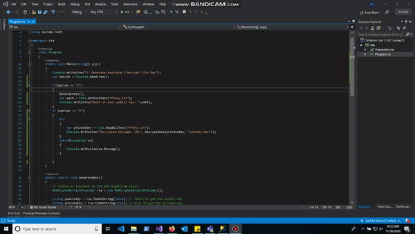

# Baphomet Ransomware

 

This is a proof of concept of how a ransomware works, and some techniques that we usually use to hijack our files.
This project is written in C# using the net-core application framework 3.1.The main idea of the code is to make it as readable as possible so that people have an idea of how this type of malware acts and works.

**Baphomet features**

* AES algorithm for file encryption.
* RSA encryption to encrypt key.
* Automatic propagation via USB.
* Hybrid encryption technique.
* Enumeration of processes to kill those selected.
* Internet connection test.
* victim information submissions (Public IP, Domainname, Country, OS.version, City, Machine name, etc).
* Program to decrypt the encryption key.
* Program to decrypt encrypted data.
* Hostname list to send the victim's data (redundancy).
* Doesn't detected to antivirus programs (Date: 11/30/2020 12:25pm).
* Hardcode image in base64 to change wallpaper (Baphomet image).

**Dynamic settings**

* List of directories we want to navigate.
* List of valid extensions.
* Host list to which we will send the data.
* List of processes that we want to stop in case they are running.
* Methods to convert base64 to image or download the image from a url.
* public key that will be hardcode to encrypt symmetric key.

**Custom arrays & var**

* Directories we want to encrypt >
***file: Program.cs***
***line: 26***
* Valid extensions to encrypt >
***file: /Utilities/Crypt.cs***
***line: 31***
* Processes that we want to stop >
***file: /Utilities/Diagnostics.cs***
***line: 18***
* (RSA) Public key that encrypts the symmetric key > 
***file: /Utilities/CryptRSA.cs***
***line: 14***
* Hostnames where we will receive the vicma data > 
***file: /Utilities/NetInfo.cs***
***line: 68***

### :heavy_exclamation_mark: In our hosts we must have an image to obtain a response status 200.:heavy_exclamation_mark:

**Projects & files**
* Baphomet = project to encrypt files.
* BpahometDecrypt = project to decrypt files.
* rsa = here we generate rsa keys to encrypt symmetric key with which we encrypt the files, Also decrypt the symmetric key that is generated in the victim.
* get.php = We upload this file to our hosting to capture the victim's data.

## Debug test

## twitter account: [@Chungo_0](https://twitter.com/Chungo_0)
## Donations to continue working on code updates: 
## Donate your grain of sand in bitcoin, to buy a coffee :( 
### Bitcoin Wallet: bc1qh5zql6xq3txndwl6sfkvmuf4euk49rffnge3gm
### :warning: Warning!

***I Am Not Responsible of any Illegal Use***

