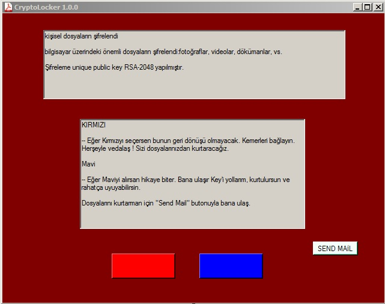
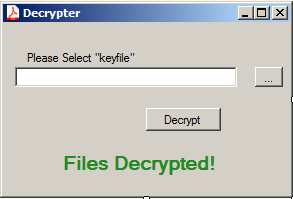
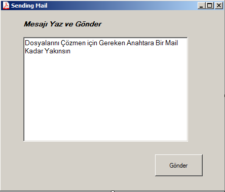
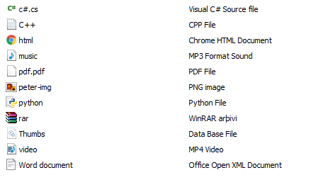
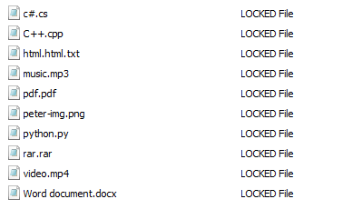

CryptoLocker 1.0.0!
===================

 
 
 
 

 

 
 
 

 
 
 ___Supported Extension___
 
 .odt , .ods , .odp , .odm , .odc , .odb , .doc , .docx , .docm , .wps , .xls , .xlsx , .xlsm , .xlsb , .xlk , .ppt , .pptx , .pptm , .mdb , .accdb , .pst , .dwg , .xf , .dxg , .wpd , .rtf , .wb2 , .mdf , .dbf , .psd , .pdd , .pdf , .eps , .ai , .indd , .cdr , .jpg , .jpe , .dng , .3fr , .arw , .srf , .sr2 , .bay , .crw , .cr2 , .dcr , .kdc , .erf , .mef , .mrwref , .nrw , .orf , .raf , .raw , .rwl , .rw2 , .r3d , .ptx , .pef , .srw , .x3f , .der , .cer , .crt , .pem , .pfx , .p12 , .p7b , .p7c , .c , .cpp , .txt , .jpeg , .png , .gif , .mp3 , .html , .css , .js , .sql , .mp4 , .flv , .m3u , .py , .desc , .con , .htm , .bin , .wotreplay , .unity3d , .big , .pak , .rgss3a , .epk , .bik , .slm , .lbf , .sav , .lng , .ttarch2 , .mpq , .re4 , .apk , .bsa , .cab , .ltx , .forge , .asset , .litemod , .iwi , .das , .upk , .bar , .hkx , .rofl , .DayZProfile , .db0 , .mpqge , .vfs0 , .mcmeta , .m2 , .lrf , .vpp_pc , .ff , .cfr , .snx , .lvl , .arch00 , .ntl , .fsh , .w3x , .rim ,psk , .tor , .vpk , .iwd , .kf , .mlx , .fpk , .zip , .vtf , .001 , .esm , .blob , .dmp , .layout , .menu , .ncf , .sid , .sis , .ztmp , .vdf , .mcgame , .fos , .sb , .im , .wmo , .itm , .map , .wmo , .sb , .svg , .cas , .gho , .iso  , .rar , .syncdb , .mdbackup , .hkdb , .hplg , .hvpl , .icxs , .itdb , .itl , .mddata , .sidd , .sidn , .bkf , .qic , .bkp , .bc7 , .bc6 , .pkpass , .tax , .gdb , .qdf , .t12 , .t13 , .ibank , .sum , .sie , .sc2save , .d3dbsp , .wmv , .avi , .wma , .m4a , .7z , .torrent , .csv , .cs , .jar , .java , .class 
