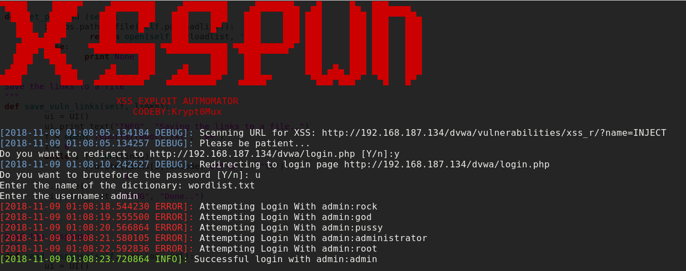
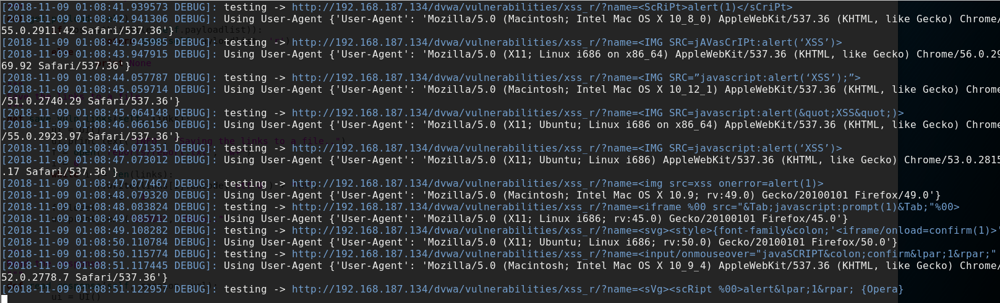

# xsspwn
Cross-Site-Scripting (XSS) Automatic Scanner

### Description
This tool is designed to test for xss vulnerabilities in web sites, it uses a list of payloads
to inject into parameters and check to see if they get reflected back.

#### Brute Force

#### Scan

#### Injections

### How to install
`python install.py`
    
### Getting Help
`python xsspwn.py -h`

### Bug Fixes
* There is no need for ***tor***, I had problems with that implemented.
* I fixed a bug where it said it only found ***2 Injections***.

### Demo
[https://www.youtube.com/watch?v=FcshLiRMfB4&t=38s](https://www.youtube.com/watch?v=FcshLiRMfB4&t=38s)
